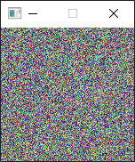

A little program I made when I discovered a stuck pixel on my new monitor :(  
A stuck pixel is not the same as a dead pixel, A dead pixel is just blacked out while a stuck pixel is stuck on one color. 

The app is 150x150 pixels, simply move the window so that it covers or contains the stuck pixel, choose a setting you want to try and then let it run for a while (most places suggest 20 minutes or more).
This works by cycling the stuck pixel through different values at 60 frames per second, and this has a chance to "unstick" the stuck pixel 
This won't hurt most monitors as they're designed to cycle through different values and high rates of speed while gaming for hours a time, but if you have an older monitor or a TV, you can try a lower framerate to closer match movies and TV shows. 

Based on jscreenfix, a free browser-based app that does the same thing, but requires the browser window to be open, taking up space 
Having a standalone app allows for me to still use the rest of the monitor while it attempts to unstick the pixel. 

Features: 
Window "stays on top" so you can do other things on the monitor while it runs. 
User can cycle through all the modes with the WASD or directional arrow keys. 

color modes: 
red, green, blue, white, cyan, magenta, yellow, random color, random grayscale 

style modes: 
Full screen swap between black and a color 
per-pixel randomized either black or a color 
per-pixel randomized grayscale or color 

https://jscreenfix.com  
https://odin-lang.org/docs/overview/  
https://www.raylib.com/  

<picture>
 
</picture>

